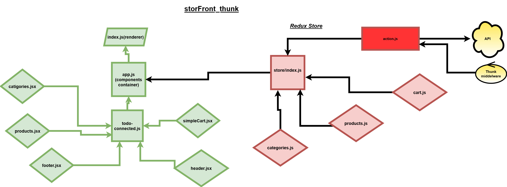

# LAB - Class: 39

## Author: Mohammad Quthama

- [submission PR](https://github.com/mohammad-qethama/storefront/pull/4)
- [master-deployment](https://optimistic-goldstine-59634a.netlify.app/cart)

### Setup

- `PORT` - 3000

#### Dependencies

- react.
- react-dom.
- react-scripts.
- react-pre
- web-vitals
- @material-ui/core
- redux 
- react-Redux
- react-devtools-extension
- @material-ui/icons
- react-if
- redux-thunk
- axios
- @reduxjs/toolkit

#### Devdependencies

- eslint

#### Running the app

- `yarn start`

- find the app @(https:localhost/:3000)

#### UML

